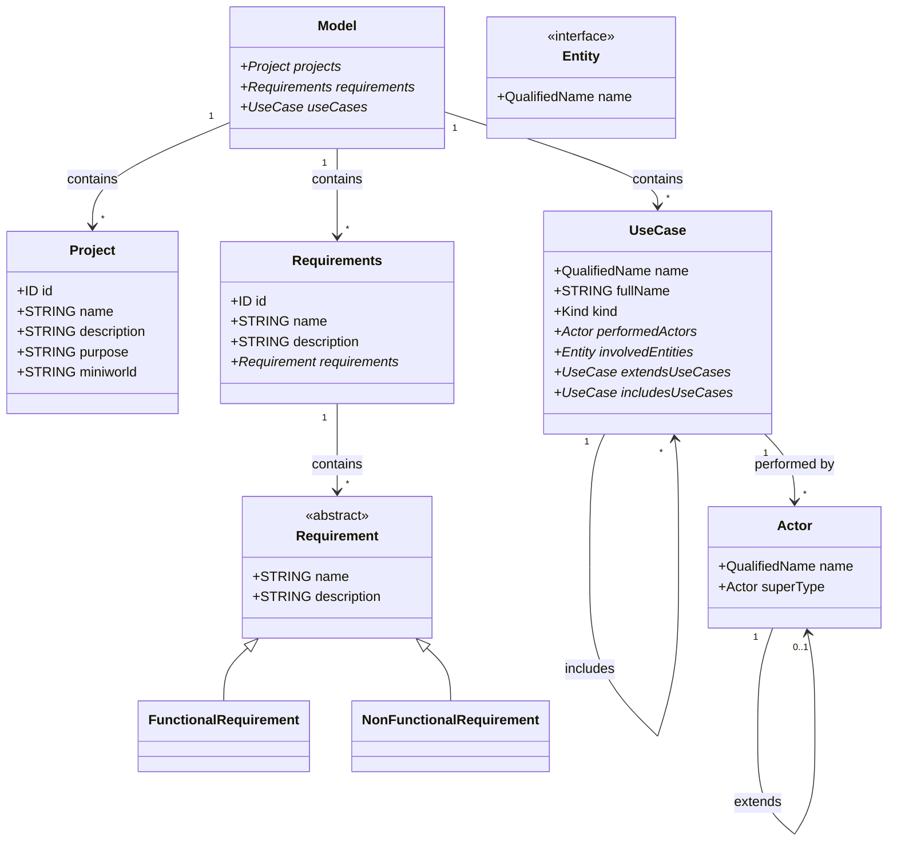

## Model
- **Description**: The `Model` serves as the entry point of the grammar. It encapsulates the overall project structure by containing multiple `Project`, `Requirements`, and `UseCase` instances.
- **Attributes**:
  - `projects`: A collection of `Project` instances associated with the model.
  - `requirements`: A collection of `Requirements` instances defining the system's requirements.
  - `useCases`: A collection of `UseCase` instances representing the system's use cases.
- **Relationships**:
  - **Contains**: 
    - Multiple `Project` instances.
    - Multiple `Requirements` instances.
    - Multiple `UseCase` instances.

## Project
- **Description**: Represents a project within the model, providing an overview and specific details about the project's purpose and scope.
- **Attributes**:
  - `id`: A unique identifier for the project.
  - `name`: The name of the project.
  - `description`: A detailed description of the project.
  - `purpose`: The primary purpose of the project.
  - `miniworld`: A string describing the project's mini-world or domain context.
- **Relationships**:
  - **Contained By**: Belongs to one `Model`.

## Requirements
- **Description**: Encapsulates the system's requirements, categorizing them into functional and non-functional types.
- **Attributes**:
  - `id`: A unique identifier for the requirements section.
  - `name`: The name of the requirements section.
  - `description`: A description outlining the scope of the requirements.
  - `requirements`: A collection of `Requirement` instances detailing individual requirements.
- **Relationships**:
  - **Contains**: 
    - Multiple `Requirement` instances.

## Requirement (Abstract Class)
- **Description**: An abstract representation of a system requirement. Serves as a base for more specific requirement types.
- **Attributes**:
  - `name`: The name of the requirement.
  - `description`: A detailed description of the requirement.
- **Inheritance**:
  - `FunctionalRequirement` and `NonFunctionalRequirement` inherit from `Requirement`.

## FunctionalRequirement
- **Description**: Represents a functional requirement detailing specific behaviors or functions the system must perform.
- **Inheritance**:
  - Inherits from `Requirement`.

## NonFunctionalRequirement
- **Description**: Represents a non-functional requirement specifying system attributes such as performance, security, or usability.
- **Inheritance**:
  - Inherits from `Requirement`.

## UseCase
- **Description**: Represents a use case within the system, defining a specific functionality or behavior that actors can perform.
- **Attributes**:
  - `name`: A `QualifiedName` that uniquely identifies the use case.
  - `fullName`: A string representing the full name of the use case.
  - `kind`: An enumeration (`Kind`) indicating the type of use case (`manage` or `view`).
  - `performedActors`: A collection of `Actor` instances that perform this use case.
  - `involvedEntities`: A collection of `Entity` instances involved in this use case.
  - `extendsUseCases`: A collection of `UseCase` instances that this use case extends.
  - `includesUseCases`: A collection of `UseCase` instances that this use case includes.
- **Relationships**:
  - **Performed By**: 
    - Multiple `Actor` instances.
  - **Involves**: 
    - Multiple `Entity` instances.
  - **Extends**: 
    - Can extend multiple `UseCase` instances.
  - **Includes**: 
    - Can include multiple `UseCase` instances.

## Actor
- **Description**: Represents an actor within the system, typically a user or external system that interacts with use cases.
- **Attributes**:
  - `name`: A `QualifiedName` that uniquely identifies the actor.
  - `entity`: An `Entity` that the actor is associated with.
  - `superType`: An optional reference to another `Actor` that this actor extends.
- **Relationships**:
  - **Extends**: An `Actor` can optionally extend another `Actor`, establishing an inheritance relationship.
  - **Implements**: Implements the `Entity` interface.

