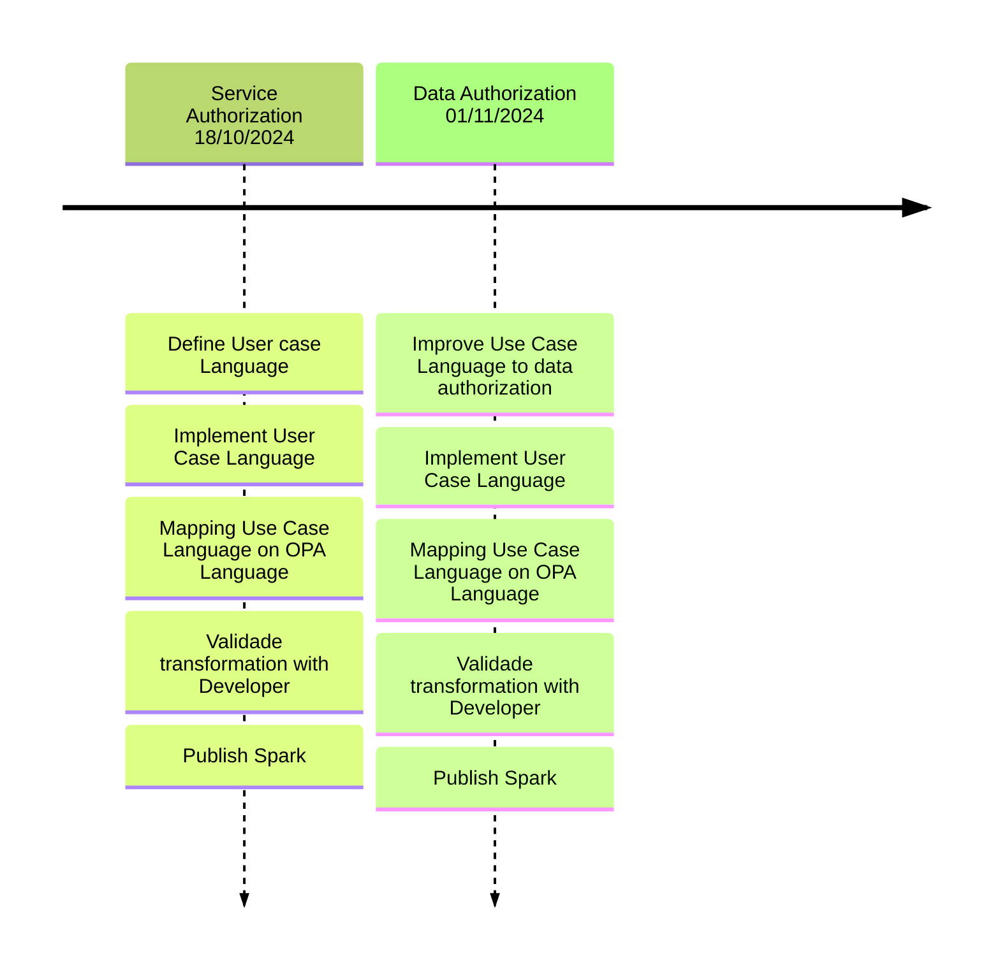

Presents the project`s developing planning.

## Backlog

| ID | Feature | Description | Importance |Proposal|
| -- | ------- | ----------- |----------- |--------|
| 1  | Create authorization service rules based on Actor and User Case`s Events| Create authorization rules on Back-End and Front-end based on relation among actores and User Case`s Events | 100 |Improve software developmen process in 10% |
| 2  | Create authorization data rules based on Actor and User Case`s Events| Create authorization data rules on Back-End and Front-end based on relation among actores and User Case`s Events (Owner Patterns) | 95 |Improve software developmen process in 10% |

## General planning

* Release 1.0 (14/10/2024 - 01/11/2024): Create authorization service rules based on Actor and User Case's Events on C# application and Create authorization data rules based on Actor and User Case`s Events  (Owner Patterns) on C#

## Release 1.0 - 01/11/2024

* **Goal**: Create authorization service and data based on User Case Diagram 

  * **Features**: ID 1 and ID 2

  * **Deadline I**  - 25/10/2024 
      * ID 1: Create authorization service rules based on Actor and User Case's Events on C# application  
  * **Deadline II** - 01/11/2024 
      * ID 2: Create authorization data rules based on Actor and User Case`s Events  (Owner Patterns) on C#

