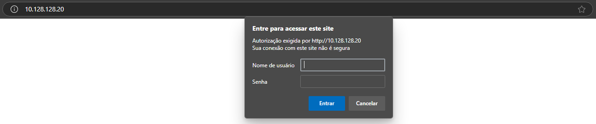
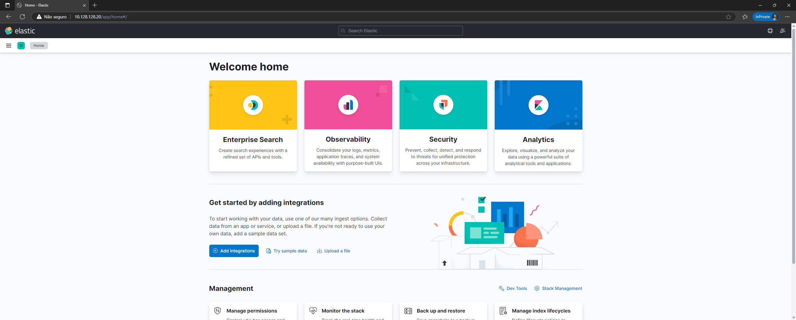

# Como Acessar o ELK Stack

Por motivos de segurança, o acesso à plataforma ELK está restrito a nossa **VPN (Virtual Private Network)**. 

## Pré-requisitos

Antes de acessar o ELK Stack, você deve garantir que os seguintes pré-requisitos estejam atendidos:

1. **Acesso à VPN**: Você deve ter as credenciais para conectar-se à VPN que dá acesso à rede onde o ELK Stack está hospedado.
2. **Cliente VPN**: Um software cliente VPN instalado e configurado no seu computador para estabelecer a conexão com a rede interna.

Veja o [Tutorial de instalação da Open-VPN no Windows](../VPN/vpn.md).

## Passos para Acessar o ELK Stack via VPN

1. **Conectar à VPN**, como instruído no tutorial de instalação da Open-VPN.
2. **Acessar seu navegador de preferência** e insirar na barra de endereços a URL ``http://10.128.128.20``

Em seguida, serão solicitadas as credenciais de acesso ao site. Colete os dados de login com o time DevOps e entre na plataforma.

#### 🤩 Uhul, você acessou o ELK Stack!

Inserindo as credenciais, você será redirecionado a página inicial do ELK. Agora, é só aproveitar a ferramenta :)