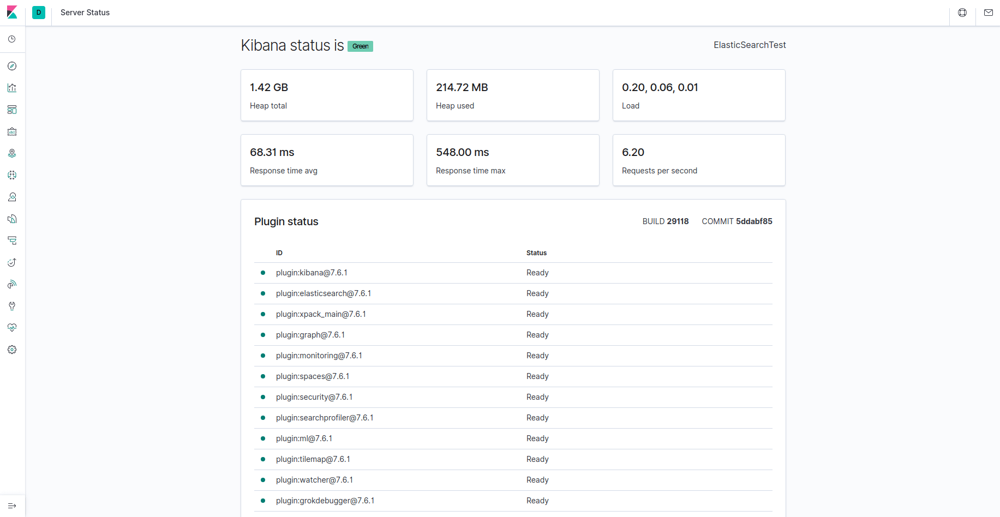
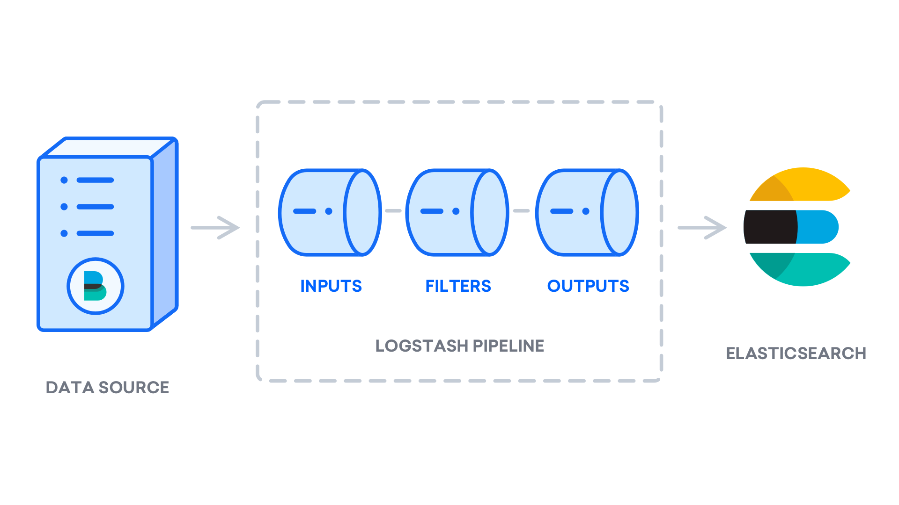
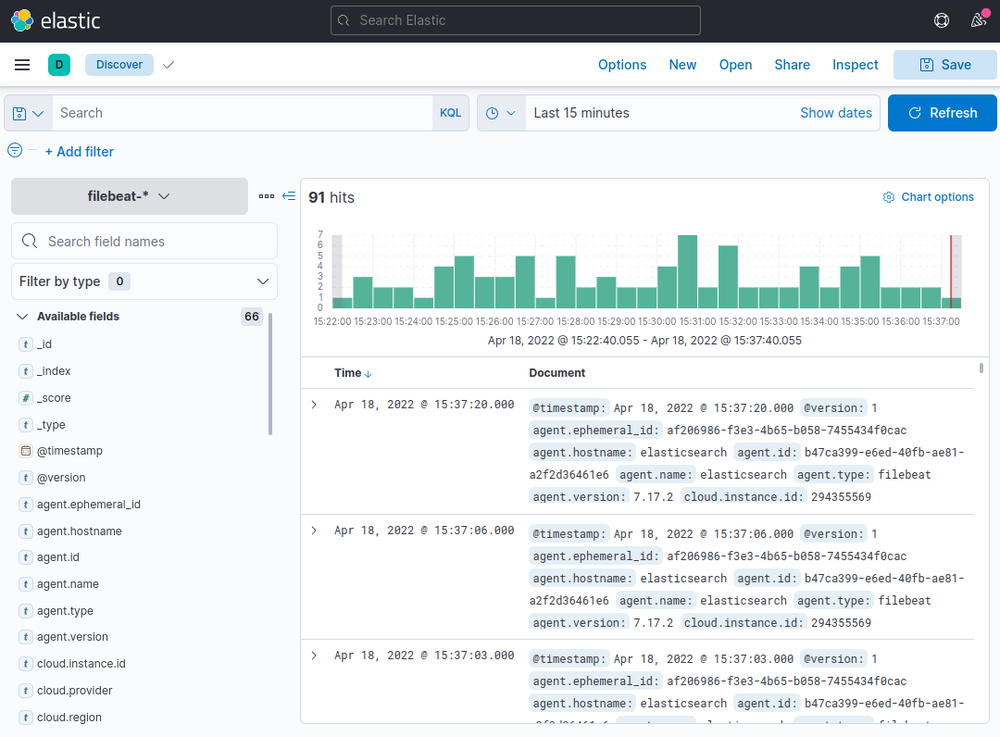
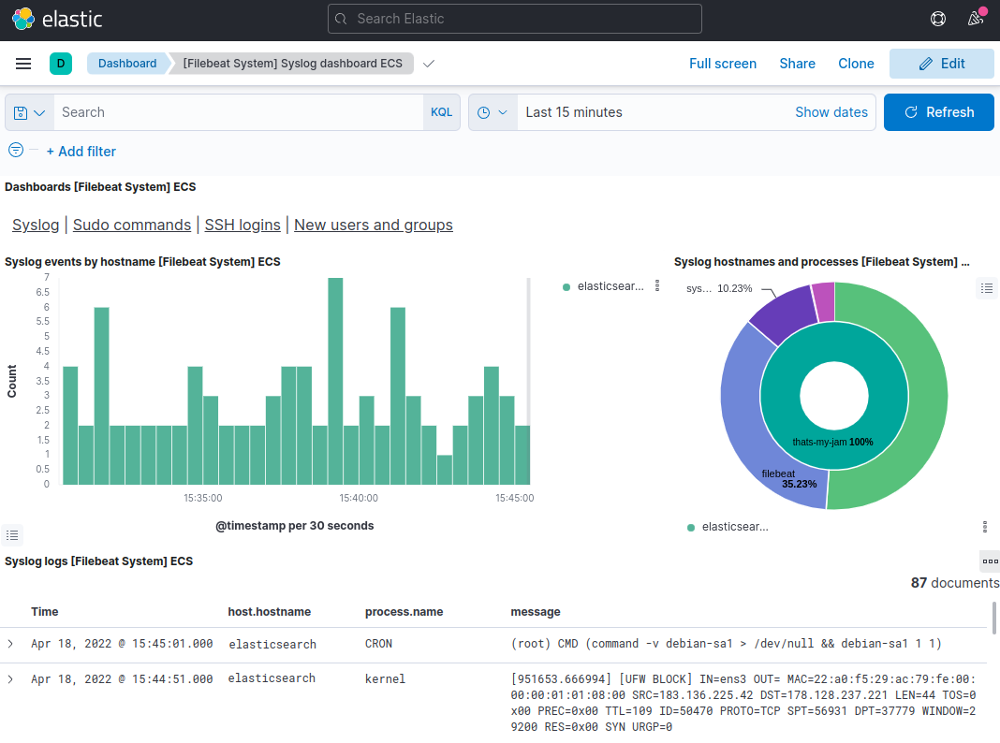
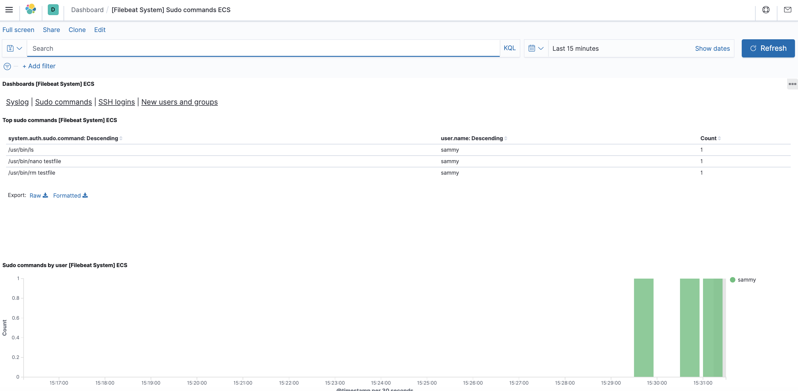

**Fonte:** [How To Install Elasticsearch, Logstash, and Kibana (Elastic Stack) on Ubuntu 22.04](https://www.digitalocean.com/community/tutorials/how-to-install-elasticsearch-logstash-and-kibana-elastic-stack-on-ubuntu-22-04#step-5-exploring-kibana-dashboards)

---

## Prerequisites
To complete this tutorial, you will need the following:

- An Ubuntu 22.04 server with 4GB RAM and 2 CPUs set up with a non-root sudo user. You can achieve this by following the [Initial Server Setup with Ubuntu 22.04.](https://www.digitalocean.com/community/tutorials/initial-server-setup-with-ubuntu-22-04)For this tutorial, we will work with the minimum amount of CPU and RAM required to run Elasticsearch. Note that the amount of CPU, RAM, and storage that your Elasticsearch server will require depends on the volume of logs that you expect.

- OpenJDK 11 installed. See the section [Installing the Default JRE/JDK](https://www.digitalocean.com/community/tutorials/how-to-install-java-with-apt-on-ubuntu-22-04#installing-the-default-jrejdk) in our guide [How To Install Java with Apt on Ubuntu 22.04](https://www.digitalocean.com/community/tutorials/how-to-install-java-with-apt-on-ubuntu-22-04)to set this up.

- Nginx installed on your server, which we will configure later in this guide as a reverse proxy for Kibana. Follow our guide on [How to Install Nginx on Ubuntu 22.04](https://www.digitalocean.com/community/tutorials/how-to-install-nginx-on-ubuntu-22-04) to set this up.

Additionally, because the Elastic Stack is used to access valuable information about your server that you would not want unauthorized users to access, it’s important that you keep your server secure by installing a TLS/SSL certificate. This is optional but **strongly encouraged**.

However, because you will ultimately make changes to your Nginx server block over the course of this guide, it would likely make more sense for you to complete the [Let’s Encrypt on Ubuntu 22.04](https://www.digitalocean.com/community/tutorials/how-to-secure-nginx-with-let-s-encrypt-on-ubuntu-22-04) guide at the end of this tutorial’s second step. With that in mind, if you plan to configure Let’s Encrypt on your server, you will need the following in place before doing so:

- A fully qualified domain name (FQDN). This tutorial will use `your_domain` throughout. You can purchase a domain name on Namecheap, get one for free on Freenom, or use the domain registrar of your choice.

- Both of the following DNS records set up for your server. You can follow this introduction to [DigitalOcean DNS](https://www.digitalocean.com/community/tutorials/an-introduction-to-digitalocean-dns) for details on how to add them.

    - An A record with `your_domain` pointing to your server’s public IP address.
    - An A record with `www.your_domain` pointing to your server’s public IP address.

## Step 1 — Installing and Configuring Elasticsearch
The Elasticsearch components are not available in Ubuntu’s default package repositories. They can, however, be installed with APT after adding Elastic’s package source list.

All of the packages are signed with the Elasticsearch signing key in order to protect your system from package spoofing. Packages which have been authenticated using the key will be considered trusted by your package manager. In this step, you will import the Elasticsearch public GPG key and add the Elastic package source list in order to install Elasticsearch.

To begin, use cURL, the command line tool for transferring data with URLs, to import the Elasticsearch public GPG key into APT. Note that we are using the arguments -fsSL to silence all progress and possible errors (except for a server failure) and to allow cURL to make a request on a new location if redirected. Pipe the output of the `curl` command to the `gpg --dearmor` command, which converts the key into a format that `apt` can use to verify downloaded packages.

```js
curl -fsSL https://artifacts.elastic.co/GPG-KEY-elasticsearch |sudo gpg --dearmor -o /usr/share/keyrings/elastic.gpg
```

Next, add the Elastic source list to the sources.list.d directory, where APT will search for new sources:
```js
echo "deb [signed-by=/usr/share/keyrings/elastic.gpg] https://artifacts.elastic.co/packages/7.x/apt stable main" | sudo tee -a /etc/apt/sources.list.d/elastic-7.x.list
```

The `[signed-by=/usr/share/keyrings/elastic.gpg]` portion of the file instructs `apt` to use the key that you downloaded to verify repository and file information for Elasticsearch packages.

Next, update your package lists so APT will read the new Elastic source:
```js
sudo apt update
```

Then install Elasticsearch with this command:
```js
sudo apt install elasticsearch
```

Elasticsearch is now installed and ready to be configured. Use your preferred text editor to edit Elasticsearch’s main configuration file, `elasticsearch.yml`. Here, we’ll use `nano`:
```js
sudo nano /etc/elasticsearch/elasticsearch.yml
```

> **Note:** Elasticsearch’s configuration file is in YAML format, which means that we need to maintain the indentation format. Be sure that you do not add any extra spaces as you edit this file.

The `elasticsearch.yml` file provides configuration options for your cluster, node, paths, memory, network, discovery, and gateway. Most of these options are preconfigured in the file but you can change them according to your needs. For the purposes of our demonstration of a single-server configuration, we will only adjust the settings for the network host.

Elasticsearch listens for traffic from everywhere on port `9200`. You will want to restrict outside access to your Elasticsearch instance to prevent outsiders from reading your data or shutting down your Elasticsearch cluster through its [REST API](https://en.wikipedia.org/wiki/Representational_state_transfer). To restrict access and therefore increase security, find the line that specifies network.host, uncomment it, and replace its value with localhost like this:

```js title="/etc/elasticsearch/elasticsearch.yml"
. . .
# ---------------------------------- Network -----------------------------------
#
# Set the bind address to a specific IP (IPv4 or IPv6):
#
network.host: localhost
. . .
```

We have specified `localhost` so that Elasticsearch listens on all interfaces and bound IPs. If you want it to listen only on a specific interface, you can specify its IP in place of `localhost`. Save and close `elasticsearch.yml`. If you’re using `nano`, you can do so by pressing `CTRL+X`, followed by `Y` and then `ENTER` .

These are the minimum settings you can start with in order to use Elasticsearch. Now you can start Elasticsearch for the first time.

Start the Elasticsearch service with `systemctl`. Give Elasticsearch a few moments to start up. Otherwise, you may get errors about not being able to connect.

```js
sudo systemctl start elasticsearch
```

Next, run the following command to enable Elasticsearch to start up every time your server boots:
```js
sudo systemctl enable elasticsearch
```

You can test whether your Elasticsearch service is running by sending an HTTP request:
```js
curl -X GET "localhost:9200"
```

You will see a response showing some basic information about your local node, similar to this:

```
Output
{
  "name" : "Elasticsearch",
  "cluster_name" : "elasticsearch",
  "cluster_uuid" : "n8Qu5CjWSmyIXBzRXK-j4A",
  "version" : {
    "number" : "7.17.2",
    "build_flavor" : "default",
    "build_type" : "deb",
    "build_hash" : "de7261de50d90919ae53b0eff9413fd7e5307301",
    "build_date" : "2022-03-28T15:12:21.446567561Z",
    "build_snapshot" : false,
    "lucene_version" : "8.11.1",
    "minimum_wire_compatibility_version" : "6.8.0",
    "minimum_index_compatibility_version" : "6.0.0-beta1"
  },
  "tagline" : "You Know, for Search"
}
```

Now that Elasticsearch is up and running, let’s install Kibana, the next component of the Elastic Stack.

## Step 2 — Installing and Configuring the Kibana Dashboard
According to the [official documentation](https://www.elastic.co/guide/en/elastic-stack/current/installing-elastic-stack.html), you should install Kibana only after installing Elasticsearch. Installing in this order ensures that the components each product depends on are correctly in place.

Because you’ve already added the Elastic package source in the previous step, you can just install the remaining components of the Elastic Stack using `apt`:
```js
sudo apt install kibana
```


Then enable and start the Kibana service:
```js
sudo systemctl enable kibana
```

```js
sudo systemctl start kibana
```

Because Kibana is configured to only listen on `localhost`, we must set up a [reverse proxy](https://www.digitalocean.com/community/tutorials/digitalocean-community-glossary#reverse-proxy) to allow external access to it. We will use Nginx for this purpose, which should already be installed on your server.

First, use the `openssl` command to create an administrative Kibana user which you’ll use to access the Kibana web interface. As an example we will name this account `kibanaadmin`, but to ensure greater security we recommend that you choose a non-standard name for your user that would be difficult to guess.

The following command will create the administrative Kibana user and password, and store them in the `htpasswd.users` file. You will configure Nginx to require this username and password and read this file momentarily:
```js
echo "kibanaadmin:`openssl passwd -apr1`" | sudo tee -a /etc/nginx/htpasswd.users
```

Enter and confirm a password at the prompt. Remember or take note of this login, as you will need it to access the Kibana web interface.

Next, we will create an Nginx server block file. As an example, we will refer to this file as `your_domain`, although you may find it helpful to give yours a more descriptive name. For instance, if you have a FQDN and DNS records set up for this server, you could name this file after your FQDN.

Using nano or your preferred text editor, create the Nginx server block file:
```js
sudo nano /etc/nginx/sites-available/your_domain
```

Add the following code block into the file, being sure to update `your_domain` to match your server’s FQDN or public IP address. This code configures Nginx to direct your server’s HTTP traffic to the Kibana application, which is listening on `localhost:5601`. Additionally, it configures Nginx to read the `htpasswd.users` file and require basic authentication.

Note that if you followed the prerequisite Nginx tutorial through to the end, you may have already created this file and populated it with some content. In that case, delete all the existing content in the file before adding the following:

```js title:"/etc/nginx/sites-available/your_domain"
server {
    listen 80;

    server_name your_domain;

    auth_basic "Restricted Access";
    auth_basic_user_file /etc/nginx/htpasswd.users;

    location / {
        proxy_pass http://localhost:5601;
        proxy_http_version 1.1;
        proxy_set_header Upgrade $http_upgrade;
        proxy_set_header Connection 'upgrade';
        proxy_set_header Host $host;
        proxy_cache_bypass $http_upgrade;
    }
}
```

When you’re finished, save and close the file.

Next, enable the new configuration by creating a symbolic link to the `sites-enabled` directory. If you already created a server block file with the same name in the Nginx prerequisite, you do not need to run this command:

```js
sudo ln -s /etc/nginx/sites-available/your_domain /etc/nginx/sites-enabled/your_domain
```

Then check the configuration for syntax errors:

```js
sudo nginx -t
```
If any errors are reported in your output, go back and double check that the content you placed in your configuration file was added correctly. Once you see syntax is ok in the output, go ahead and restart the Nginx service:

```js
sudo systemctl reload nginx
```

If you followed the initial server setup guide, you should have a UFW firewall enabled. To allow connections to Nginx, we can adjust the rules by typing:

```js
sudo ufw allow 'Nginx Full'
```

> **Note:** If you followed the prerequisite Nginx tutorial, you may have created a UFW rule allowing the `Nginx HTTP` profile through the firewall. Because the `Nginx Full` profile allows both HTTP and HTTPS traffic through the firewall, you can safely delete the rule you created in the prerequisite tutorial. Do so with the following command:

``` js
sudo ufw delete allow 'Nginx HTTP'
```

Kibana is now accessible via your FQDN or the public IP address of your Elastic Stack server. You can check the Kibana server’s status page by navigating to the following address and entering your login credentials when prompted:
```
http://your_domain/status
```

This status page displays information about the server’s resource usage and lists the installed plugins.


> **Note:** As mentioned in the Prerequisites section, it is recommended that you enable SSL/TLS on your server. You can follow the [Let’s Encrypt](https://www.digitalocean.com/community/tutorials/how-to-secure-nginx-with-let-s-encrypt-on-ubuntu-22-04) guide now to obtain a free TLS certificate for Nginx on Ubuntu 22.04. After obtaining your TLS certificates, you can come back and complete this tutorial.

Now that the Kibana dashboard is configured, let’s install the next component: Logstash.

## Step 3 — Installing and Configuring Logstash
Although it’s possible for Beats to send data directly to the Elasticsearch database, it is common to use Logstash to process the data. This will allow you more flexibility to collect data from different sources, transform it into a common format, and export it to another database.

Install Logstash with this command:
```js
sudo apt install logstash
```

After installing Logstash, you can move on to configuring it. Logstash’s configuration files reside in the `/etc/logstash/conf.d` directory. For more information on the configuration syntax, you can check out the [configuration reference](https://www.elastic.co/guide/en/logstash/current/configuration-file-structure.html) that Elastic provides. As you configure the file, it’s helpful to think of Logstash as a pipeline which takes in data at one end, processes it in one way or another, and sends it out to its destination (in this case, the destination being Elasticsearch). A Logstash pipeline has two required elements, `input` and `output`, and one optional element, `filter`. The input plugins consume data from a source, the filter plugins process the data, and the output plugins write the data to a destination.



Create a configuration file called `02-beats-input.conf` where you will set up your Filebeat input:

```js
sudo nano /etc/logstash/conf.d/02-beats-input.conf
```

Insert the following `input` configuration. This specifies a `beats` input that will listen on TCP port `5044`.

```txt title="/etc/logstash/conf.d/02-beats-input.conf"
input {
  beats {
    port => 5044
  }
}
```

Save and close the file.

Next, create a configuration file called `30-elasticsearch-output.conf`:
```js
sudo nano /etc/logstash/conf.d/30-elasticsearch-output.conf
```

Insert the following `output` configuration. Essentially, this output configures Logstash to store the Beats data in Elasticsearch, which is running at `localhost:9200`, in an index named after the Beat used. The Beat used in this tutorial is Filebeat:

```txt title="/etc/logstash/conf.d/30-elasticsearch-output.conf"
output {
  if [@metadata][pipeline] {
	elasticsearch {
  	hosts => ["localhost:9200"]
  	manage_template => false
  	index => "%{[@metadata][beat]}-%{[@metadata][version]}-%{+YYYY.MM.dd}"
  	pipeline => "%{[@metadata][pipeline]}"
	}
  } else {
	elasticsearch {
  	hosts => ["localhost:9200"]
  	manage_template => false
  	index => "%{[@metadata][beat]}-%{[@metadata][version]}-%{+YYYY.MM.dd}"
	}
  }
}
```

Save and close the file.

Test your Logstash configuration with this command:

```
sudo -u logstash /usr/share/logstash/bin/logstash --path.settings /etc/logstash -t
```

If there are no syntax errors, your output will display `Config Validation Result: OK. Exiting Logstash` after a few seconds. If you don’t see this in your output, check for any errors noted in your output and update your configuration to correct them. Note that you will receive warnings from OpenJDK, but they should not cause any problems and can be ignored.

If your configuration test is successful, start and enable Logstash to put the configuration changes into effect:

```
sudo systemctl start logstash
```

```
sudo systemctl enable logstash
```

Now that Logstash is running correctly and is fully configured, let’s install Filebeat.

## Step 4 — Installing and Configuring Filebeat
The Elastic Stack uses several lightweight data shippers called Beats to collect data from various sources and transport them to Logstash or Elasticsearch. Here are the Beats that are currently available from Elastic:

- **Filebeat:** collects and ships log files.
- **Metricbeat:** collects metrics from your systems and services.
- **Packetbeat:** collects and analyzes network data.
- **Winlogbeat:** collects Windows event logs.
- **Auditbeat:** collects Linux audit framework data and monitors file integrity.
- **Heartbeat:** monitors services for their availability with active probing.
In this tutorial we will use Filebeat to forward local logs to our Elastic Stack.

Install Filebeat using `apt`:

```js
sudo apt install filebeat
```

Next, configure Filebeat to connect to Logstash. Here, we will modify the example configuration file that comes with Filebeat.

Open the Filebeat configuration file:
```js
sudo nano /etc/filebeat/filebeat.yml
```

> **Note:** As with Elasticsearch, Filebeat’s configuration file is in YAML format. This means that proper indentation is crucial, so be sure to use the same number of spaces that are indicated in these instructions.

Filebeat supports numerous outputs, but you’ll usually only send events directly to Elasticsearch or to Logstash for additional processing. In this tutorial, we’ll use Logstash to perform additional processing on the data collected by Filebeat. Filebeat will not need to send any data directly to Elasticsearch, so let’s disable that output. To do so, find the `output.elasticsearch` section and comment out the following lines by preceding them with a `#`:

```md= title: "/etc/filebeat/filebeat.yml"
...
#output.elasticsearch:
  # Array of hosts to connect to.
  #hosts: ["localhost:9200"]
...
```

Then, configure the `output.logstash` section. Uncomment the lines `output.logstash:` and `hosts: ["localhost:5044"]` by removing the `#`. This will configure Filebeat to connect to Logstash on your Elastic Stack server at port `5044`, the port for which we specified a Logstash input earlier:
```md= title:"/etc/filebeat/filebeat.yml"
output.logstash:
  # The Logstash hosts
  hosts: ["localhost:5044"]
```

Save and close the file.

The functionality of Filebeat can be extended with Filebeat modules. In this tutorial we will use the system module, which collects and parses logs created by the system logging service of common Linux distributions.

Let’s enable it:

```
sudo filebeat modules enable system
```

You can see a list of enabled and disabled modules by running:
```
sudo filebeat modules list
```

You will see a list similar to the following:
```
Output
Enabled:
system

Disabled:
apache2
auditd
elasticsearch
icinga
iis
kafka
kibana
logstash
mongodb
mysql
nginx
osquery
postgresql
redis
traefik
...
```

By default, Filebeat is configured to use default paths for the syslog and authorization logs. In the case of this tutorial, you do not need to change anything in the configuration. You can see the parameters of the module in the `/etc/filebeat/modules.d/system.yml` configuration file.

Next, we need to set up the Filebeat ingest pipelines, which parse the log data before sending it through logstash to Elasticsearch. To load the ingest pipeline for the system module, enter the following command:
```
sudo filebeat setup --pipelines --modules system
```

Next, load the index template into Elasticsearch. An Elasticsearch index is a collection of documents that have similar characteristics. Indexes are identified with a name, which is used to refer to the index when performing various operations within it. The index template will be automatically applied when a new index is created.

To load the template, use the following command:
```
sudo filebeat setup --index-management -E output.logstash.enabled=false -E 'output.elasticsearch.hosts=["localhost:9200"]'
```
```
Output
Index setup finished.
```

Filebeat comes packaged with sample Kibana dashboards that allow you to visualize Filebeat data in Kibana. Before you can use the dashboards, you need to create the index pattern and load the dashboards into Kibana.

As the dashboards load, Filebeat connects to Elasticsearch to check version information. To load dashboards when Logstash is enabled, you need to disable the Logstash output and enable Elasticsearch output:
```
sudo filebeat setup -E output.logstash.enabled=false -E output.elasticsearch.hosts=['localhost:9200'] -E setup.kibana.host=localhost:5601
```

```
Output
Overwriting ILM policy is disabled. Set `setup.ilm.overwrite:true` for enabling.

Index setup finished.
Loading dashboards (Kibana must be running and reachable)
Loaded dashboards
Setting up ML using setup --machine-learning is going to be removed in 8.0.0. Please use the ML app instead.
See more: https://www.elastic.co/guide/en/elastic-stack-overview/current/xpack-ml.html
Loaded machine learning job configurations
Loaded Ingest pipelines
```

Now you can start and enable Filebeat:
```
sudo systemctl start filebeat
```
```
sudo systemctl enable filebeat
```

If you’ve set up your Elastic Stack correctly, Filebeat will begin shipping your syslog and authorization logs to Logstash, which will then load that data into Elasticsearch.

To verify that Elasticsearch is indeed receiving this data, query the Filebeat index with this command:
```
curl -XGET 'http://localhost:9200/filebeat-*/_search?pretty'
```
You should receive output similar to this:
```
Output
. . .
{
  "took" : 4,
  "timed_out" : false,
  "_shards" : {
    "total" : 2,
    "successful" : 2,
    "skipped" : 0,
    "failed" : 0
  },
  "hits" : {
    "total" : {
      "value" : 4040,
      "relation" : "eq"
    },
    "max_score" : 1.0,
    "hits" : [
      {
        "_index" : "filebeat-7.17.2-2022.04.18",
        "_type" : "_doc",
        "_id" : "YhwePoAB2RlwU5YB6yfP",
        "_score" : 1.0,
        "_source" : {
          "cloud" : {
            "instance" : {
              "id" : "294355569"
            },
            "provider" : "digitalocean",
            "service" : {
              "name" : "Droplets"
            },
            "region" : "tor1"
          },
          "@timestamp" : "2022-04-17T04:42:06.000Z",
          "agent" : {
            "hostname" : "elasticsearch",
            "name" : "elasticsearch",
            "id" : "b47ca399-e6ed-40fb-ae81-a2f2d36461e6",
            "ephemeral_id" : "af206986-f3e3-4b65-b058-7455434f0cac",
            "type" : "filebeat",
            "version" : "7.17.2"
          },
. . .
```

If your output shows 0 total hits, Elasticsearch is not loading any logs under the index you searched for, and you will need to review your setup for errors. If you received the expected output, continue to the next step, in which we will see how to navigate through some of Kibana’s dashboards.

## Step 5 — Exploring Kibana Dashboards
Let’s return to the Kibana web interface that we installed earlier.

In a web browser, go to the FQDN or public IP address of your Elastic Stack server. If your session has been interrupted, you will need to re-enter entering the credentials you defined in Step 2. Once you have logged in, you should receive the Kibana homepage:


Click the **Discover** link in the left-hand navigation bar (you may have to click the the **Expand** icon at the very bottom left to see the navigation menu items). On the **Discover** page, select the predefined **filebeat-*** index pattern to see Filebeat data. By default, this will show you all of the log data over the last 15 minutes. You will see a histogram with log events, and some log messages below:



Here, you can search and browse through your logs and also customize your dashboard. At this point, though, there won’t be much in there because you are only gathering syslogs from your Elastic Stack server.

Use the left-hand panel to navigate to the **Dashboard** page and search for the **Filebeat System** dashboards. Once there, you can select the sample dashboards that come with Filebeat’s `system` module.

For example, you can view detailed stats based on your syslog messages:


You can also view which users have used the `sudo` command and when:


Kibana has many other features, such as graphing and filtering, so feel free to explore.

## Conclusion
In this tutorial, you’ve learned how to install and configure the Elastic Stack to collect and analyze system logs. Remember that you can send just about any type of log or indexed data to Logstash using [Beats](https://www.elastic.co/products/beats), but the data becomes even more useful if it is parsed and structured with a Logstash filter, as this transforms the data into a consistent format that can be read easily by Elasticsearch.