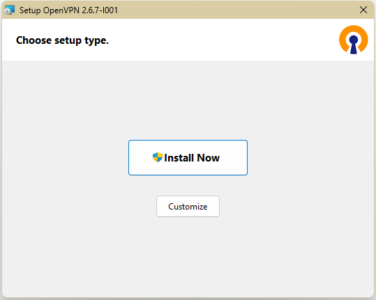
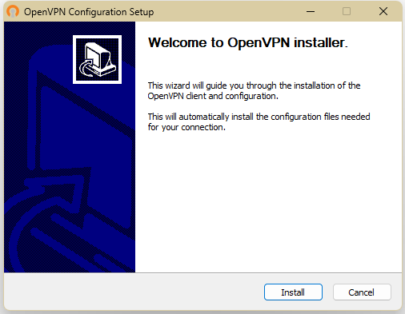
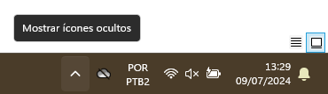
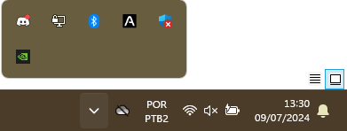
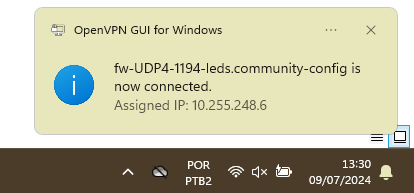
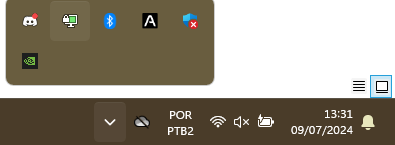
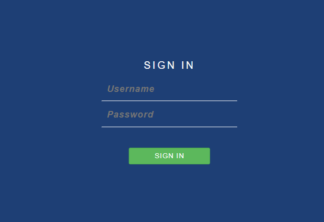

<<<<<<< HEAD:docs/processes/devops/VPN/vpn.md
# Tutorial de instalação da Open-VPN no Windows
## Por que instalar o OpenVPN?
O cliente OpenVPN dá acesso à rede interna do LEDS. A rede interna hospeda serviços que só podem ser acessados por meio da VPN.

## Como conseguir acesso?
1. Se já nâo possuir o bundle de acesso (geralmente um .exe do OpenVPN, juntamente com seu user e password), solicite-o ao SysAdmin.
2. Com o bundle em mãos, instale o cliente da OpenVPN.


  
**_Clique para instalar o cliente do OpenVPN_**

  
**_Clique em fechar para completar mais um passo da instalação_**

3. Depois do cliente ser instalado, abrirá um serviço de pós-instalação, que instalará os certificados necessários para a VPN. Instale-os também.

  
**_Clique em install para instalar os certificados._**

4. Clique na setinha no canto inferior direito para mostrar itens ocultos e acessar o OpenVPN.

  
**_Clique nessa setinha._**

  
**_Clique no ícone DE MONITOR (esse segundo na imagem, a direita do Discord) com o botão direito._**

  
**_Clique em connect para se conectar a VPN._**

  
**_Se tudo der certo, essa notificação será exibida._**

  
**_Clique na setinha e cheque se o ícone está verde, se sim. Tudo deu certo._**

## IMPORTANTE! Provavlmente sua configuração falhou, com algum erro de rotas. Siga [esse tutorial](vpnproblema.md) para corrigir e retorne nessa página após isto.

## IMPORTANTE! Troque a senha e valide seu acesso.
Para testar se o acesso foi validado e para trocar a sua senha de usuário. É de _**SUMA IMPORTÂNCIA**_ criar uma nova senha segura na interface do firewall. Siga estes passos:

1. Acesse *__fw.intranet.leds.dev.br__* . Se tudo deu certo, você estará na interface. Se ocorreu algum erro de rede, muito provavelmente sua VPN foi configurada de forma errada. Solicite ajuda para o SysAdmin.

  
**_Landing page do firewall._**


2. Insira seu user e senha. O user geralmente é *nome.sobrenome* e a senha padrâo *metroque*

  
**_Insira dados padrão._**

3. Se tudo deu certo, você estará na tela de trocar a senha. Caso dê algum erro de permissão, peça ajuda ao SysAdmin.

4. Troque sua senha e salve.

  
**_Insira seus dados e clique em save._**


### Pronto! Seu acesso foi validado!
=======
---
title: "Open-VPN: Instalação no Windows"
sidebar_position: 3
---
## Tutorial de instalação da Open-VPN no Windows
O cliente OpenVPN dá acesso à rede interna do LEDS. A rede interna hospeda serviços que só podem ser acessados por meio da VPN.

### Como conseguir acesso?
1. Se já nâo possuir o bundle de acesso (geralmente um .exe do OpenVPN, juntamente com seu user e password), solicite-o ao SysAdmin.
2. Com o bundle em mãos, instale o cliente da OpenVPN.

  
**_Clique para instalar o cliente do OpenVPN._**

  
**_Clique em fechar para completar mais um passo da instalação_**

3. Depois do cliente ser instalado, abrirá um serviço de pós-instalação, que instalará os certificados necessários para a VPN. Instale-os também.

  
**_Clique em install para instalar os certificados._**

4. Clique na setinha no canto inferior direito para mostrar itens ocultos e acessar o OpenVPN.

  
**_Clique nessa setinha._**

  
**_Clique no ícone DE MONITOR (esse segundo na imagem, a direita do Discord) com o botão direito._**

  
**_Clique em connect para se conectar a VPN._**

  
**_Se tudo der certo, essa notificação será exibida._**

  
**_Clique na setinha e cheque se o ícone está verde, se sim. Tudo deu certo._**

:::tip[IMPORTANTE!]

Provavalmente sua configuração falhou com algum erro de rotas. Siga as orientações do tópico [Resolvendo problemas da VPN](#resolvendo-problemas-da-vpn) para corrigir e retorne aqui.
:::

:::warning[TROQUE SUA SENHA E VALIDE SEU ACESSO!]
Para testar se o acesso foi validado e para trocar a sua senha de usuário, é de _**SUMA IMPORTÂNCIA**_ criar uma nova senha segura na interface do firewall. Siga estes passos:

1. Acesse *__fw.intranet.leds.dev.br__* . Se tudo deu certo, você estará na interface. Se ocorreu algum erro de rede, muito provavelmente sua VPN foi configurada de forma errada. Solicite ajuda para o SysAdmin.

  
**_Landing page do firewall._**


2. Insira seu user e senha. O user geralmente é *nome.sobrenome* e a senha padrâo *metroque*

  
**_Insira dados padrão._**

3. Se tudo deu certo, você estará na tela de trocar a senha. Caso dê algum erro de permissão, peça ajuda ao SysAdmin.

4. Troque sua senha e salve.

  
**_Insira seus dados e clique em save._**


Pronto! Seu acesso foi validado!
:::


## Resolvendo problemas da VPN

A VPN, às vezes, pode ter certo problema de rota. E o Notepad, sendo o PÉSSIMO editor de texto que ele é, impede você de editar o arquivo de configuração por conta desse arquivo ser protegido com privilégios de administrador.

Portanto, a solução é usar o VSCode (ou migrar para o Linux).

Abra o arquivo (pelo menu do VSCode) em `C:\Program Files\OpenVPN\config`

No fim do arquivo, adicione as seguintes rotas:
```
route 10.128.128.0 255.255.128.0
route 10.255.248.0 255.255.252.0
route 192.168.211.0 255.255.255.0 10.255.248.1
route 192.168.128.0 255.255.192.0 10.255.248.1
```

Salve e dê permissão de admin para o VSCode. Reinicie sua máquina, os erros devem sumir.

Siga o resto dos passos do [Tutorial](vpn.md)
>>>>>>> main:docs/tutorials/VPN/vpn.md
